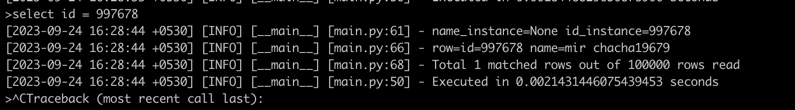

# First iteration

    PR: [https://github.com/Dipenbhatt03/py-db/pull/4/files]
    Adding 1 lakh rows take 85 seconds i.e 1171 row/sec
    searching worst case takes 2.39 seconds due to linearity

# Second iteration

    PR: [https://github.com/Dipenbhatt03/py-db/pull/2/files]

Implmenting binary tree for storage and inserting fairly
random data, searching speed dramatically increases
to 0.002 seconds

# Third Iteration

    PR: https://github.com/Dipenbhatt03/py-db/pull/5    

Due to the implementation of standard binary tree, insertion on skewed data had become
extremely slow and same goes for searching during worst case.

After AVL implementation and some Row class optimisation the performance jumped to 28 seconds.

